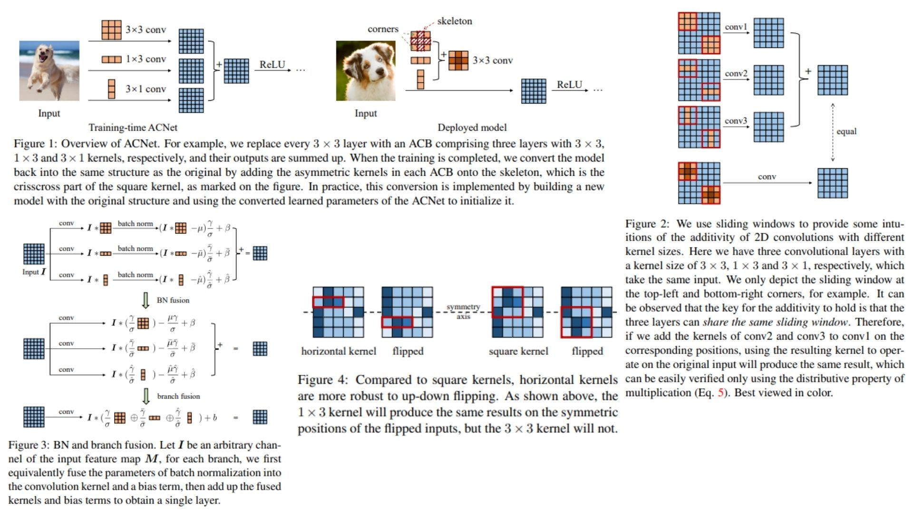

# 🐭 ACNet-Replication

This repository provides a **PyTorch replication** of the **ACNet (Asymmetric Convolutional Network)** framework, focusing on improving CNN feature learning by replacing standard convolution layers with **asymmetric multi-branch convolutional blocks**.  It reconstructs the full pipeline from the original paper, including **asymmetric convolution decomposition (3×3, 1×3, 3×1 branches), batch normalization fusion, and structural re-parameterization for inference-time efficiency**.

Paper reference: *ACNet: Strengthening the Kernel Skeletons for Powerful CNN via Asymmetric Convolution Blocks*  https://arxiv.org/abs/1904.05473  

---

## Overview 🧬



> ACNet improves standard convolutional networks by decomposing each **3×3 convolution into three asymmetric branches (3×3, 1×3, 3×1)** during training. These branches learn complementary spatial patterns and are later **fused into a single equivalent convolution kernel for inference**.

Key ideas:

- **Asymmetric Convolution Decomposition**: replaces each $$3 \times 3$$ kernel with multi-branch structure  
- **Branch-wise Feature Learning**: horizontal, vertical, and full spatial receptive fields  
- **Kernel Additivity**: multiple convolution outputs can be merged into a single equivalent kernel  
- **Structural Re-parameterization**: training-time multi-branch → inference-time single conv  
- **Zero inference overhead** after fusion  

---

## Core Math 📐

**Multi-branch convolution:**

$$
Y = \sum_{i \in \{3\times3,\,1\times3,\,3\times1\}} \text{BN}(X * K_i)
$$

**BatchNorm fusion:**

$$
\text{BN}(X * K) = X * \left(\frac{\gamma}{\sigma}K\right) + \beta
$$


**Kernel additivity:**

$$
X * K_1 + X * K_2 = X * (K_1 \oplus K_2)
$$


**Final inference form:**

$$
Y = X * K_{\text{fused}} + b
$$

---

## Why ACNet Matters ⚡

- Enhances CNN feature representation without changing backbone depth  
- Captures directional spatial patterns (horizontal + vertical + isotropic)  
- Enables structural re-parameterization for efficient deployment  
- Improves accuracy with **no extra inference cost**  

---

## Repository Structure 🏗️

```bash
ACNet-Replication/
├── src/
│   ├── blocks/
│   │   ├── acb.py
│   │   └── bn_fusion.py
│   │
│   ├── fusion/
│   │   ├── kernel_fusion.py
│   │   └── deploy.py
│   │
│   ├── modules/
│   │   ├── ac_resblock.py
│   │   └── ac_stage.py
│   │
│   ├── model/
│   │   ├── acnet.py
│   │   └── classifier.py
│   │
│   └── config.py
│
├── images/
│   └── figmix.jpg
│
├── requirements.txt
└── README.md
```

---

## 🔗 Feedback

For questions or feedback, contact:  
[barkin.adiguzel@gmail.com](mailto:barkin.adiguzel@gmail.com)
